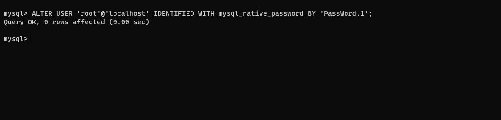
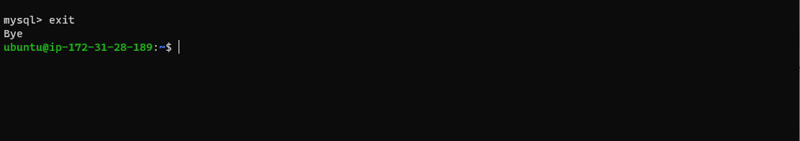

# Project 2- Lemp stack Implimentation

### Firstly, I connected my Ec2 instance and remote into the terminal. Ahd below are the following steps i took to get this project done.

## Step 1- Installing the nginx web server
1. I ran `sudo apt update` Since this is my first time using apt for this session, so, i started off by updating my server’s package index and below is the output (the beginning part and the end part respectively).

2. I ran `sudo apt install nginx` to get Nginx installed. Entered Y to confirm that i want to install Nginx when prompted. overall, below is the output (the beginning part and the end part respectively).

3. I ran `sudo systemctl status nginx` to verify that nginx was successfully installed and is running as a service in Ubuntu and below is the output. Note- If it is green and running, then you did everything correctly.

4. I added a rule to EC2 configuration to open inbound connection through port 80 for my web server to be able to recieve traffic.
After this, I tried to access it locally in our Ubuntu shell using `curl http://54.237.225.203:80` and also from my intenet browser using `http://54.237.225.203:80` and below are the outputs respectively.

## Step 2- Installing mysql
1. I ran `sudo apt install mysql-server` to acquire and install this software and below is the output (the beginning part and the end part respectively).

2. I ran `sudo mysql` to log in to the MySQL console when the installation was done and below is the output.

3. I ran `ALTER USER 'root'@'localhost' IDENTIFIED WITH mysql_native_password BY 'PassWord.1';`  i set a password for the root user, using mysql_native_password as default authentication method and below is the output.

4. Ater setting the password i exited the console by running `exit` to exit the MySQL shell and below is the output.

5. I start the interactive script by running `sudo mysql_secure_installation` and followed prompt, i added the password, no,no,yes, yes, no, no, yes respectively and below are the outputs.

6. When i finished, i tested if i was able to log in to the MySQL console by typing `sudo mysql -p` and below is the output. Notice the -p flag in this command, which will prompt you for the password used after changing the root user password.

7. I exiedt the MySQL console by typing `exit` and below is the output.

  At this pont, my  MySQL server is now installed and secured.

  ## Step 3- Installing PHP
  1. I ran `sudo apt install php-fpm php-mysql` to install the 2 php packages at once and below are the outputs.
  
 

 ## Step 4- Configuring php to use nginx processor
 1. I ran `sudo mkdir /var/www/projectLEMP` to Create the root web directory for my_domain. I also assigned ownership of the directory with the $USER environment variable by running `sudo chown -R $USER:$USER /var/www/projectLEMP` and below is the output.
 

 2. Using a nano editor, i ran `sudo nano /etc/nginx/sites-available/projectLEMP` to open a new configuration file in Nginx’s sites-available directory, pasted the codes, saved the file with ctrl x and exited and below are the outputs. 
 
 
 

 3. I ran `sudo ln -s /etc/nginx/sites-available/projectLEMP /etc/nginx/sites-enabled/` to activate my configuration by linking to the config file from Nginx’s sites-enabled directory which will tell Nginx to use the configuration next time it is reloaded  and below is the output.
 

 4. I ran `sudo nginx -t` test my configuration for syntax errors and below is the output.
 

5. I ran `sudo unlink /etc/nginx/sites-enabled/default` to disable default Nginx host that is currently configured to listen on port 80, followed by `sudo systemctl reload nginx` to reload Nginx to apply the changes and exited and below are the outputs.

6. Now my new website is now active, but the web root /var/www/projectLEMP is still empty. I created an index.html file `sudo echo 'Hello LEMP from hostname' $(curl -s http://169.254.169.254/latest/meta-data/public-hostname) 'with public IP' $(curl -s http://169.254.169.254/latest/meta-data/public-ipv4) > /var/www/projectLEMP/index.html` so that i can test that my new server block works as expected and below is the output.

7. I opened my website URL using IP address on my browser by running `http://54.237.225.203:80` also, opened it with DNS name using `http://ec2-54-237-225-230.compute-1.amazonaws.com:80` and below are the outputs.

## Step 5- Testing php with nginx
1. I created a test PHP file in my document root by Opening a new file called info.php within my document root in my nano text editor using `sudo nano /var/www/projectLEMP/info.php` pasted and saved  `<?php
phpinfo();` in  into the new file and below are the outputs.

2. I ran `http://54.237.225.203/info.php` to access this page in my web browser and below is the output.

## Step 6- Retrieving data from msql database with php (continued)
1. Firstly, I ran `sudo mysql` connect to the MySQL console using the root account and below is the output.

2. I ran `CREATE DATABASE `example_database`;` to create a new database and below is the output.

3. I ran `CREATE USER 'example_user'@'%' IDENTIFIED WITH mysql_native_password BY 'password';` to create a new user and grant him full privileges on the database i just created. This command created a new user named example_user user’s password as password and below is the output.

4. I ran `GRANT ALL ON example_database.* TO 'example_user'@'%';` to give this user permission over the example_database database and below is the output.
  

 5. I used `exit` to exit the mysql console and below is the output.
   

  6. I ran `mysql -u example_user -p` to test if the new user has the proper permissions by logging in to the MySQL console again using the new password and below is the output.
  

  7. To confirm that i have access to the example_database database, i ran `SHOW DATABASES;`and below is the output.
   

  8. I created a test table named todo_list by running `CREATE TABLE example_database.todo_list (
item_id INT AUTO_INCREMENT,
content VARCHAR(255),
PRIMARY KEY(item_id)
);` and below is the output.

9. I inserted a few rows of content in the test table by repeating this command `INSERT INTO example_database.todo_list (content) VALUES ("My first important item");` a few times, using different VALUES and below is the output.

10. I ran `SELECT * FROM example_database.todo_list;` to confirm that the data was successfully saved to my table and below is the output.
 

11. After confirming that i have a valid data in my test table, i exited the MySQL console by unsing `exit` and below is the output.

12. I created a new PHP file in my custom web root directory using a nano editor by running `nano /var/www/projectLEMP/todo_list.php` and copied the content into my todo_list.php script, saved and closed the file and below are the outputs.

13. Lastly, i ran `http://54.237.225.203/todo_list.php` to access this page in my web browser and below is the output.

It's a wrap! Thank you for reading!

